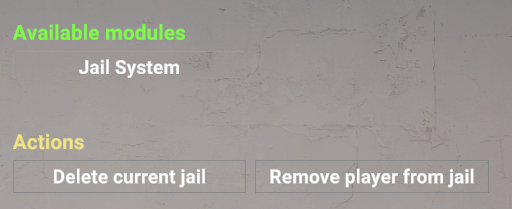
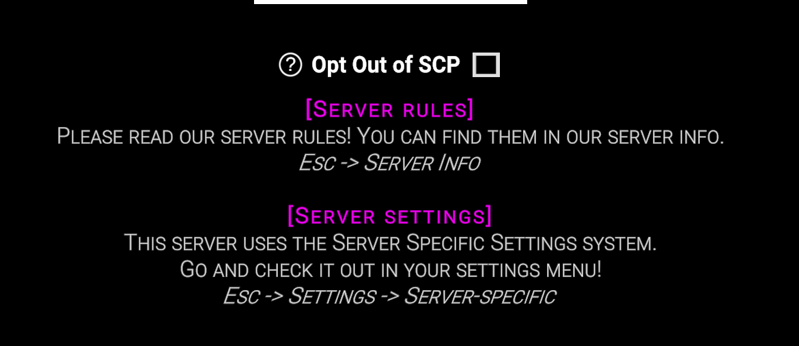

# About FrikanUtils (Default module)

This is the default module that needs to be installed for FrikanUtils. All other modules build on this plugin.

> [!NOTE]
> Documentation for developers is still a work in progress and will be put in
> the [wiki](https://github.com/FrikandelbroodjeCommunity/FrikanUtils/wiki)
>
> Currently, most public methods within the code have documentation, which you can view on GitHub.

# Installation

Place the [latest release](https://github.com/FrikandelbroodjeCommunity/FrikanUtils/releases/latest) for
"FrikanUtils.dll" in the LabAPI plugin folder.

# Features

This plugin is a library plugin which plugin developers can build on, most features below won't add anything on their
own.

## Custom Dummy Actions

Allows custom menus within the Dummies section of the Remote Admin menu. The image below is an example of how a jail
system could look, allowing moderators to select players in their RA and add/remove them from the jail.



> [!WARNING]
> This will cause issues with plugins that use other Dummy Action implementations. In the future ways to
> mitigate the conflicts may be created.

## File System

The file system allows all files accessed using this system to be placed in the same folder. Additionally, plugin
developers can create their own extensions to this system, allowing for custom search functions. Searching in other
locations, or another method.

The default implementation searches the following path depending on the given folder and file name:
```/LabAPI/configs/{port|global}/FrikanUtils/{folder}/{filename}```

> [!TIP]
> Using a custom extension it is possible to download file from a central server. Useful for when you have multiple
> servers which require the same files.

## Hint System

The hint system allows server owners to show a configurable message in the lobby to all their players. Additionally,
plugins can add information to this message shown in the message, or show messages that need to be constantly updated
during the game more easily.

To use rainbow text, you can use `<color=rainbow>`. This will only work for hints sent using this hint system.



## Keycards

FrikanUtils makes some small improvements into how keycards work when thrown. When hitting a doorbutton which requires a
certain keycard level, custom keycards that are made using the [custom keycard system](#custom-keycards) will now work.

Additionally, when a keycard is thrown on a doorbutton, but does not have the permissions required, the door will show
the same error as if a player was interacting with it (turning the button red and beeping).

### Custom Keycards

Developers can use the Custom Keycard wrapper to create custom keycards more easily. The wrapper allows the keycard to
be updated even after it has been given to a player. These custom keycards can also be linked to an actual keycard type,
allowing them to behave like this linked keycard in SCP-914.

> [!TIP]
> It is possible to create rainbow keycards, which will shift their hue constantly.

## Npc

There are some additional helpers to create dummies and get the player for the spawned dummy. One of these helpers also
uses a custom connection, this way the dummy does not show up in the Remote Admin or on the player list.

> [!TIP]
> A very basic AI is provided which is able to follow a player. In the future some more AIs may be
> added ([see future plans](../README.md#future-plans)).

## Server Specific Settings

A custom system for server specific settings is provided, with the goal of allowing multiple developers to easily create
menus. With this implementation the developer is given full control over how their menu is rendered and which actions
are taken when a value is changed.

> [!WARNING]
> This will cause issues with plugins that use other Server Specific Settings implementations. In the future ways to
> mitigate the conflicts may be created.

### Global Settings

When multiple plugins have menus with only 1-2 settings, it may cause unnecessary cluttering. Because of this a global
settings system was made. The settings registered to the global settings system are automatically combined into a single
menu.

By default, there is 1 global setting, the holiday override. With this, plugins that use the holiday utility in order to
check which holiday is active, will think the override holiday is active, allowing developers to more easily debug
things that only trigger during holidays. The `frikanutils.debug` permission is required to use this setting.

# Config

| Config                      | Default | Description                                                                                                                                                                                                                                                                                                   |
|-----------------------------|---------|---------------------------------------------------------------------------------------------------------------------------------------------------------------------------------------------------------------------------------------------------------------------------------------------------------------|
| `Debug`                     | `false` | When set to true, debug logs will be included in the console. These logs may contain useful information when developing plugins that use FrikanUtils.                                                                                                                                                         |
| `UseCustomDummyActions`     | `true`  | Whether the [Custom Dummy Actions system](#Custom-Dummy-Actions) is enabled. Disable this if there are conflicts.                                                                                                                                                                                             |
| `UseHintSystem`             | `true`  | Whether the [Hint System](#Hint-System) is enabled. Disable this if there are conflicts.                                                                                                                                                                                                                      |
| `UseKeycardImprovements`    | `true`  | Whether the [thrown keycard improvements](#Keycards) are enabled. Disable this if there are conflicts.                                                                                                                                                                                                        |
| `UseServerSpecificSettings` | `true`  | Whether the [Server Specific Settings system](#Server-Specific-Settings) are enabled. Disable this if there are conflicts.                                                                                                                                                                                    |
| `RainbowTextColors`         | ...     | The colors the rainbow tag (`<color=rainbow>`) cycles through.                                                                                                                                                                                                                                                |
| `RainbowColorTicks`         | `2`     | Each time the hints get updated it will attempt to move to the next color, because the time between each update is determined by the refresh rate, this can be used to make sure the colors don't update too often. This indicates how many updates need to happen before the color can continue to the next. |
| `HintRefreshTime`           | `0.5`   | The time between the updates of the hint. Decreasing the time will update the hint contents more frequently, but increases network traffic.                                                                                                                                                                   |
| `ServerSettingsMenus`       | ...     | This is an automatically generated property and should not be changed.                                                                                                                                                                                                                                        |
| `GlobalClientSettings`      | ...     | This is an automatically generated property and should not be changed.                                                                                                                                                                                                                                        |
| `NoSettingsText`            | ...     | Displayed when the user has at least 1 menu in the Server Specific Settings, but does not have any static menus.                                                                                                                                                                                              |
| `OverrideHoliday`           | `None`  | The holiday override the server currently uses. Can be `None`, `Christmas`, `Halloween`, or `AprilFools`. Can also be set using its Global Setting.                                                                                                                                                           |
| `LobbyText`                 | ...     | The text that is displayed in the lobby for all players. If you want to disable this text, leave it empty.                                                                                                                                                                                                    |
| `RemoteFileProviderUrl`     | Nothing | For instructions on how to use the remote file provider, check the [wiki](https://github.com/FrikandelbroodjeCommunity/FrikanUtils/wiki/Using-the-File-System).                                                                                                                                               |
